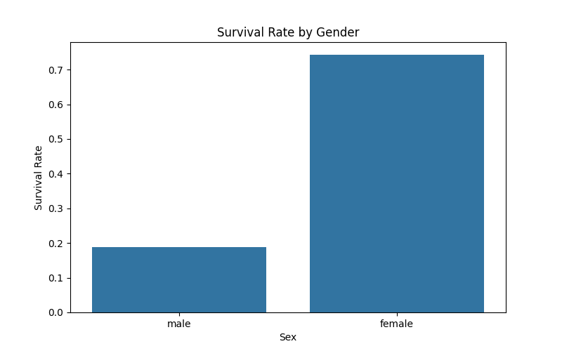
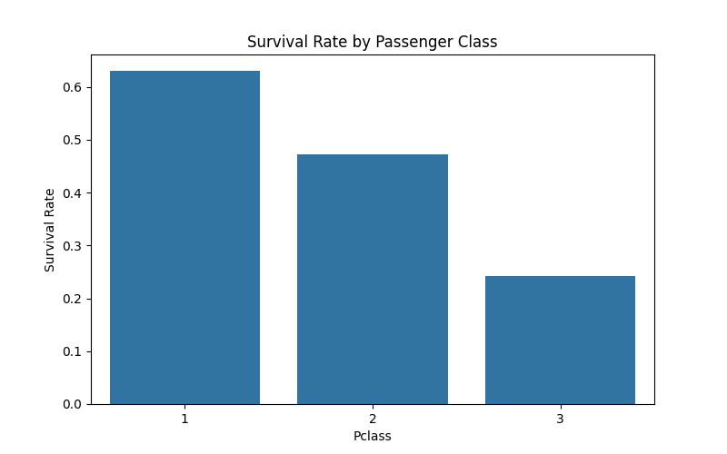
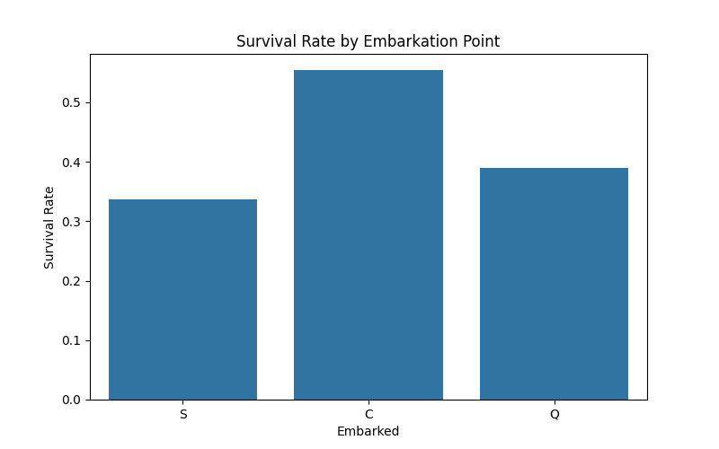
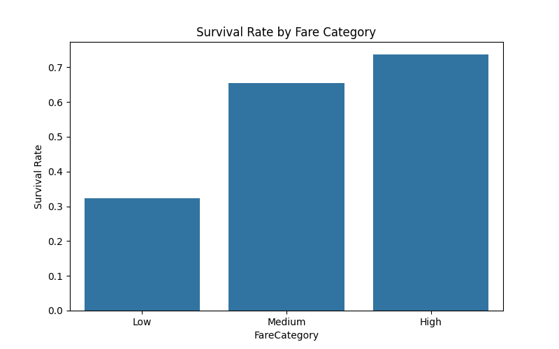

# Titanic - Exploratory Data Analysis (EDA)

  
*Image Source: Wikimedia Commons*

## Overview
This repository contains an **Exploratory Data Analysis (EDA)** of the Titanic dataset. The goal is to uncover insights about the passengers, survival rates, and factors that influenced survival.

## Dataset
The dataset used in this analysis is the famous **Titanic dataset**, which contains information about the passengers aboard the RMS Titanic, including:
- Passenger demographics (age, gender, class)
- Survival status
- Cabin and ticket information

## Key Questions Explored
- What was the overall survival rate?
- How did gender and passenger class affect survival?
- Were children more likely to survive?
- What other factors (e.g., fare, embarkation point) influenced survival?

## Tools Used
- **Python**
- **Pandas** for data manipulation
- **Matplotlib** and **Seaborn** for data visualization
- **Jupyter Notebook** for interactive analysis

## Installation
To run this analysis locally, follow these steps:

1. Clone the repository:
   ```bash
   git clone https://github.com/TheDataMage/Titanic-EDA.git

2.Install the required libraries:
   pip install -r requirements.txt

3. Open the Jupyter Notebook:
   jupyter notebook Titanic_EDA.ipynb

## Results
Here are some key findings from the analysis:

### Survival Rate by Gender
- **Female**: 74.20%
- **Male**: 18.89%



### Survival Rate by Passenger Class
- **First Class**: 62.96%
- **Second Class**: 47.28%
- **Third Class**: 24.24%



### Survival Rate by Embarkation Point
- **Cherbourg (C)**: 55.36%
- **Queenstown (Q)**: 38.96%
- **Southampton (S)**: 33.70%



### Survival Rate by Fare Category
- **Low Fare**: 29.41%
- **Medium Fare**: 47.83%
- **High Fare**: 62.96%


